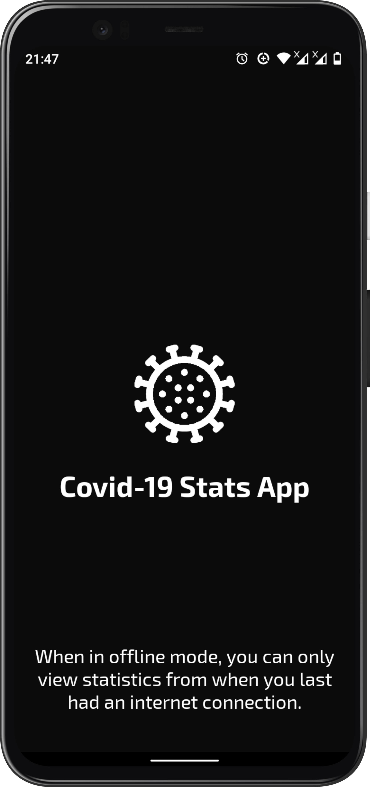
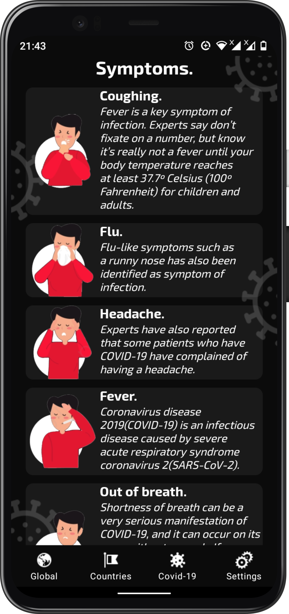

# COVID-19 Stat App
 An android app consuming [ a Covid-19 Stats API](https://documenter.getpostman.com/view/8854915/SzS7R6uu?version=latest) to display realtime statistics of Covid-19 in all affected countries and global statistics.
 
 It has been built using MVVM architecture and repository pattern as well as various jetpack components.

 > You can download the final apk [here](https://drive.google.com/file/d/1-3Yr31F5tYShllwkeKLrzsoZ9pdLs4DX/view?usp=sharing).

 > Min Api Level: 19 - Android version 4.4 (Kitkat) [Supports over 98.1% of devices](https://developer.android.com/about/dashboards)

## App Demo

### Splash Screen.
The splash screen show various tip regarding the app and the current global pandemic.

 
   

### Global Statistics Fragment.
This fragment show the global statistics of the Covid-19 pandemic.

 
  

### Countries Statistics Fragment.
This fragment show the statistics of the Covid-19 pandemic in all affected countries. You can also search for a specific country.

 
  
  

### Covid-19 Info Fragment.
This fragment show some information about the Covid-19 virus and how it is spread. It also show some information on how to prevent infection and some common symptoms of infection.

 
  
  

### Settings Fragment.
This fragment allows the user to change the app theme between light and dark theme. The user can also send a user to the developer regarding feature request or feedback. The user can also see social media link to the developer and more information about the developer.

 

## Tools and Libraries

- The app is entirely written in [Kotlin](https://kotlinlang.org/) (including [Coroutines](https://kotlinlang.org/docs/reference/coroutines-overview.html)) with [ktlint](https://github.com/pinterest/ktlint) for code style
* Makes use of [Android Jetpack Components](https://developer.android.com/jetpack/) like: 
  - Livedata- Handle data in a lifecycle-aware fashion.
  - Room- For offline persistance of data fetched from the network source.
  - Viewmodel- Manage your UI's data in a lifecycle-aware fashion.
  - Databinding- Minimize the glue code necessary to bind your application logic and layouts.
  - Navigation- Reduces the boilerplate code that was used to handle navigation and passing of data from one activity/fragment to another.
     
* [Android KTX](https://developer.android.com/kotlin/ktx) for more fluent use of Android APIs

* [Retrofit](https://square.github.io/retrofit/)/[OkHttp](https://square.github.io/okhttp/) for networking

* [Kodein](https://kodein.org/Kodein-DI/?6.5/android) for dependency injection

* [ConstraintLayout](https://developer.android.com/reference/androidx/constraintlayout/widget/ConstraintLayout) 2.0

* Designed and built using Material Design [tools](https://material.io/tools/) and [components](https://material.io/develop/android/)

## Prerequisites
You will need the following to run this project:
1. A laptop or desktop machine with internet access
2. Android Studio Stable Channel (Latest Stable Release)

## Setting Up
* Clone the Repository from Github
* Open the project folder using Android Studio IDE

## Inspiration
This came when i needed stats of the current Covid-19 global pandemic.

